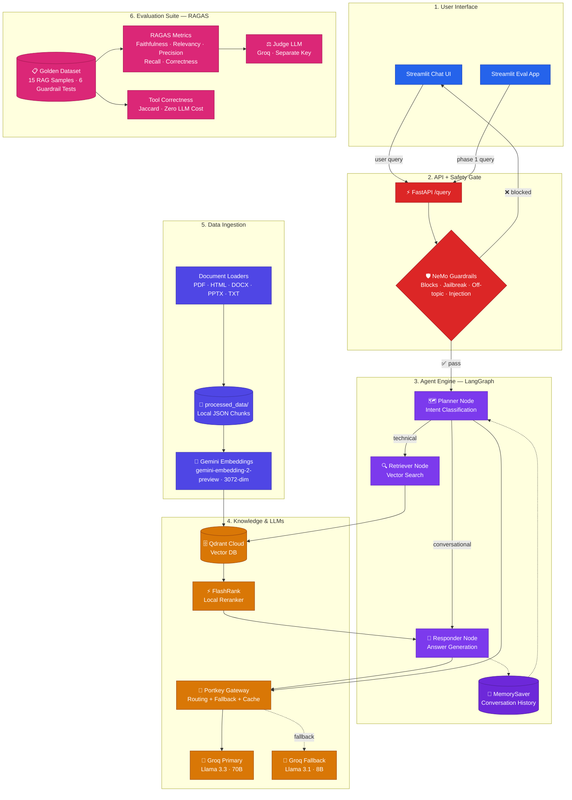

# Architecture — Built Up Stage by Stage

This is the complete system, built one lesson at a time across 6 branches.

## Stage 6 — Evals (final)

Every subgraph above was introduced one lesson at a time:
- Ingestion — Stage 1
- Agent Engine (no rerank/memory) — Stage 2
- FlashRank + MemorySaver — Stage 3
- Safety Gate — Stage 4
- LLM Gateway — Stage 5
- Evaluation Suite — Stage 6 (this branch)
